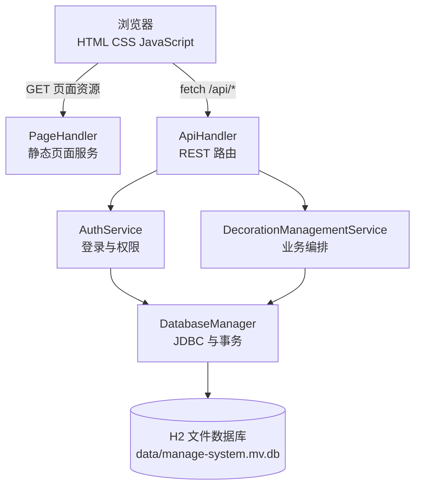
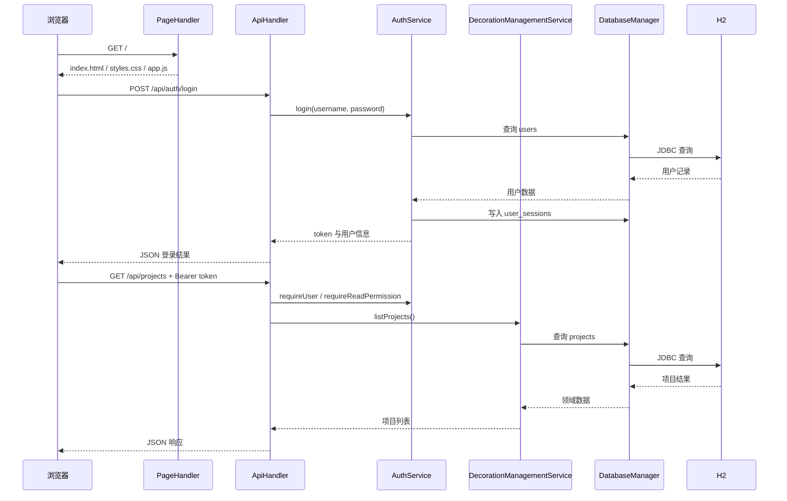

# 系统架构

## 总体架构

系统采用内置 HTTP 服务的单体分层架构。浏览器访问静态页面并通过 `fetch` 调用 REST 风格接口，接口层完成路由、鉴权和响应封装，业务层负责装修管理业务，数据层通过 JDBC 访问 H2 文件数据库。



## 分层职责

| 层次 | 主要类/目录 | 职责 |
| --- | --- | --- |
| 表现层 | `src/main/resources/static` | 页面布局、样式、登录状态、表单交互和数据渲染 |
| Web 层 | `PageHandler`、`ApiHandler` | 静态资源、API 路由、请求参数、JSON 响应和异常转换 |
| 安全层 | `AuthService`、`AuthUser` | 登录、token、会话、角色权限和当前用户 |
| 业务层 | `DecorationManagementService` | 客户、员工、账号、项目、阶段、供应商、采购、收款和看板业务 |
| 数据层 | `DatabaseManager`、`db` | 连接、建表、迁移、初始化数据、查询、更新和事务 |
| 领域层 | `domain` | 客户、员工、项目、阶段、采购和收款等不可变领域记录 |
| 工具层 | `util` | JSON、HTTP、密码和业务异常等通用能力 |

## 请求处理流程



## 项目结构

```text
ManageSystem
├── docs
│   ├── 项目概览.md
│   ├── 开发与运行.md
│   ├── 系统架构.md
│   ├── 系统设计与UML.md
│   ├── 课程设计报告.md
│   ├── 数据库表结构.md
│   └── 接口文档.md
├── lib
│   └── h2-2.2.224.jar
├── pom.xml
├── start.sh
└── src/main
    ├── java/org/example
    │   ├── db
    │   ├── domain
    │   ├── security
    │   ├── service
    │   ├── util
    │   ├── web
    │   └── Main.java
    └── resources/static
        ├── index.html
        ├── styles.css
        └── app.js
```

## 业务模块

`ApiHandler` 将业务按资源分为认证、看板、客户、员工、账号、项目、施工阶段、供应商、材料采购和收款模块；`DecorationManagementService` 对每个资源提供列表、详情、新增、修改、删除等操作，并集中处理字段校验、数据迁移兼容和业务约束。

## 设计特点与边界

- 当前是单体应用，API、静态页面和数据库访问运行在同一个 Java 进程中
- 当前没有独立的前端构建工具，前端资源直接从 classpath 提供
- 当前没有 Spring Boot、ORM 或外部应用服务器
- `users.employee_id` 和 `material_purchases.supplier_id` 是应用层逻辑关联，具体约束见[数据库表结构](数据库表结构.md)