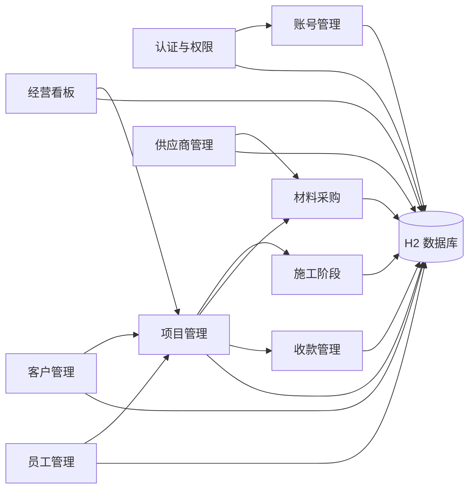
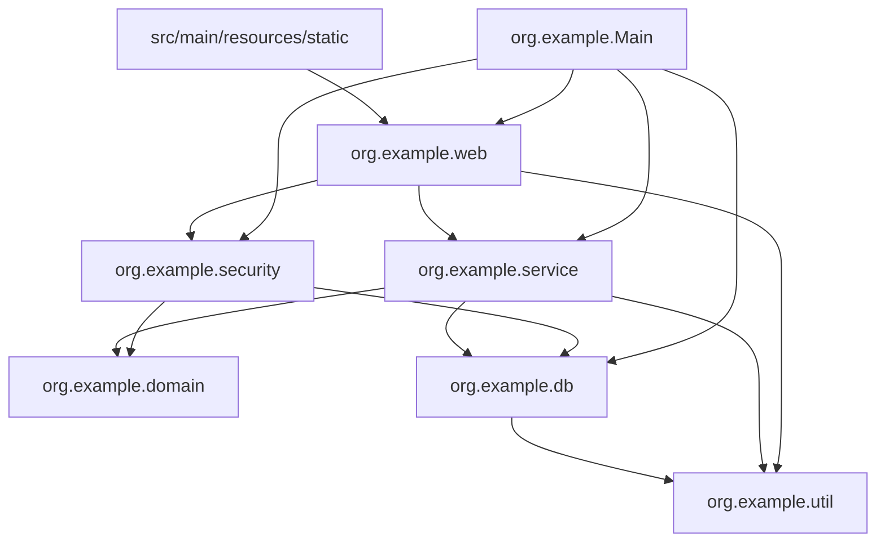
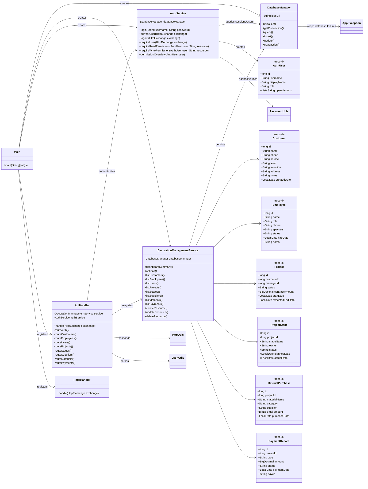
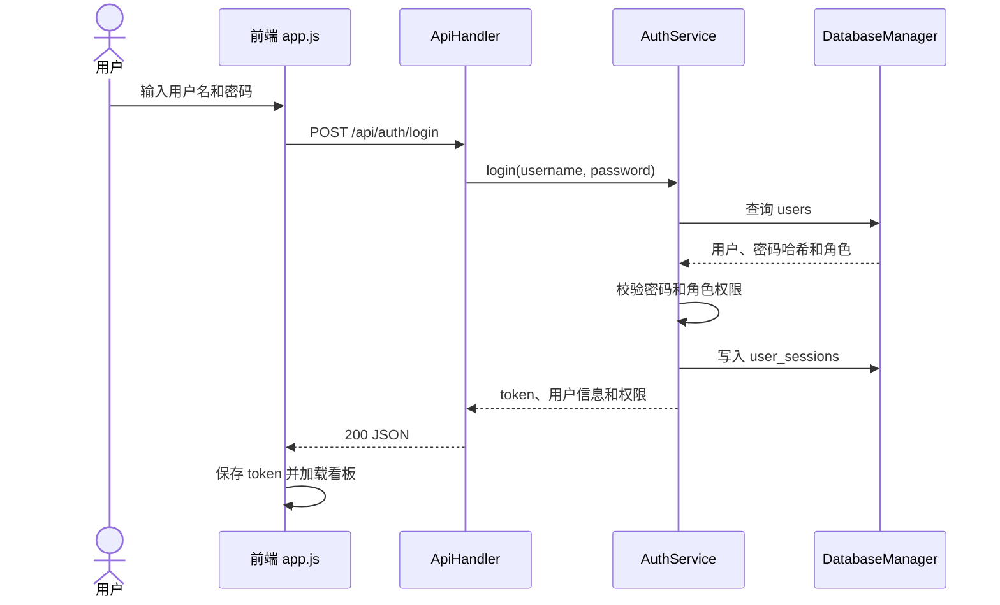
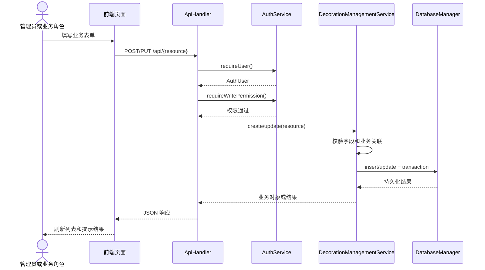
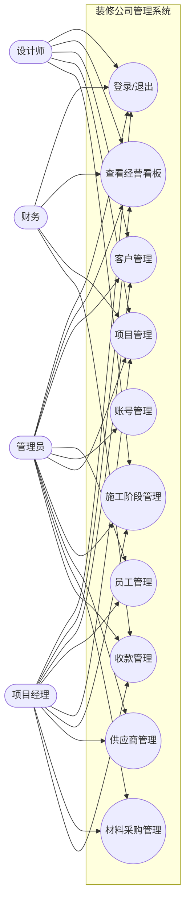
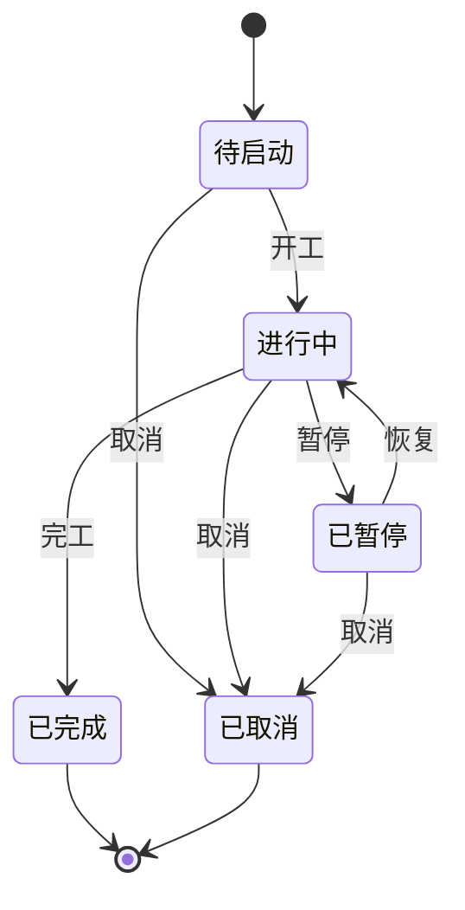
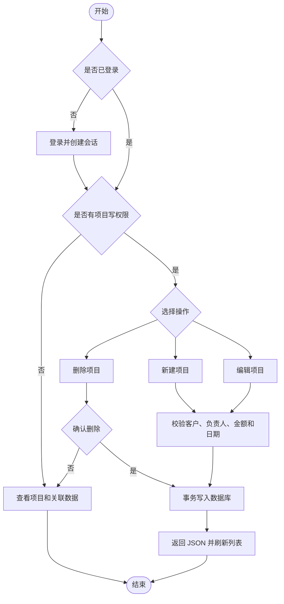
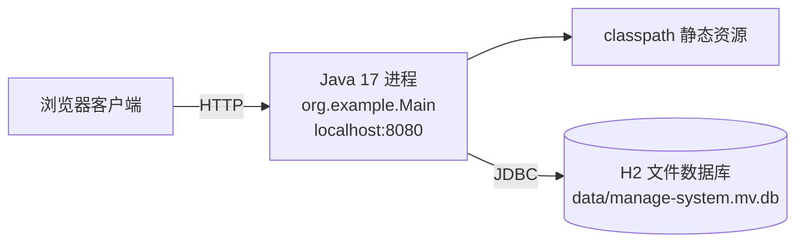
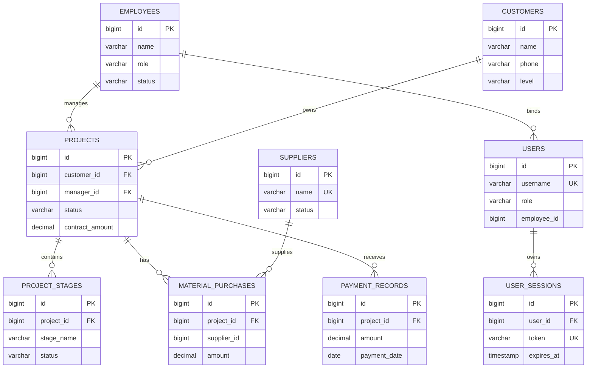

# 系统设计与 UML

本文件中的图均使用 Mermaid 编写，GitHub 和支持 Mermaid 的 Markdown 编辑器可以直接渲染。图中的类、方法和关系根据当前 Java 源码整理；省略了重复的 CRUD 方法和实现细节，以保持图表可读性。

## 1. 模块图

## 2. 包图

## 3. 核心类图

## 4. 登录时序图

## 5. 业务 CRUD 协作图

## 6. 角色用例图

## 7. 项目状态图

项目实际可用状态值由业务层和初始化数据共同决定，提交报告时应以数据库中的当前枚举为准。

## 8. 项目管理活动图

## 9. 部署图

## 10. 数据库 ER 图

## 11. 图与源码对应关系

| 图 | 主要源码依据 |
| --- | --- |
| 模块图、包图 | `Main.java`、`web`、`security`、`service`、`db`、`domain`、`util` |
| 类图 | `ApiHandler`、`PageHandler`、`AuthService`、`DecorationManagementService`、`DatabaseManager` 和领域 record |
| 登录时序图 | `ApiHandler.routeAuth`、`AuthService.login`、`DatabaseManager` |
| CRUD 协作图 | `ApiHandler.route*`、`DecorationManagementService.create/update/delete*` |
| 用例图 | `AuthService` 的角色权限和前端菜单控制 |
| ER 图 | `DatabaseManager.initialize` 与[数据库表结构](数据库表结构.md) |