# 系统设计与 UML

本图册根据当前项目源码整理，共 12 张图；每张均交付 PlantUML 源码、PNG 和 SVG。PNG 可插入课程报告，SVG 适合清晰打印，`.puml` 可继续编辑。采用 plantuml-skill 的从代码建模流程，使用本地 PlantUML 1.2025.2 渲染，图表源码未上传第三方。

## 课程要求与交付索引

| 图号 | 图表 | 源码 | PNG | SVG |
| --- | --- | --- | --- | --- |
| 1 | 核心实现类图 | [源文件](uml/01-implementation-class.puml) | [图片](uml/01-implementation-class.png) | [矢量图](uml/01-implementation-class.svg) |
| 2 | 领域 record 类图 | [源文件](uml/02-domain-class.puml) | [图片](uml/02-domain-class.png) | [矢量图](uml/02-domain-class.svg) |
| 3 | 角色用例图 | [源文件](uml/03-use-case.puml) | [图片](uml/03-use-case.png) | [矢量图](uml/03-use-case.svg) |
| 4 | 分层组件架构图 | [源文件](uml/04-architecture.puml) | [图片](uml/04-architecture.png) | [矢量图](uml/04-architecture.svg) |
| 5 | 包图 | [源文件](uml/05-package.puml) | [图片](uml/05-package.png) | [矢量图](uml/05-package.svg) |
| 6 | 登录时序图 | [源文件](uml/06-login-sequence.puml) | [图片](uml/06-login-sequence.png) | [矢量图](uml/06-login-sequence.svg) |
| 7 | 新建项目时序图 | [源文件](uml/07-project-sequence.puml) | [图片](uml/07-project-sequence.png) | [矢量图](uml/07-project-sequence.svg) |
| 8 | 通信图（协作图） | [源文件](uml/08-communication.puml) | [图片](uml/08-communication.png) | [矢量图](uml/08-communication.svg) |
| 9 | 新建项目活动图 | [源文件](uml/09-project-activity.puml) | [图片](uml/09-project-activity.png) | [矢量图](uml/09-project-activity.svg) |
| 10 | 项目状态图 | [源文件](uml/10-project-state.puml) | [图片](uml/10-project-state.png) | [矢量图](uml/10-project-state.svg) |
| 11 | 部署图 | [源文件](uml/11-deployment.puml) | [图片](uml/11-deployment.png) | [矢量图](uml/11-deployment.svg) |
| 12 | 数据库 ER 图 | [源文件](uml/12-er.puml) | [图片](uml/12-er.png) | [矢量图](uml/12-er.svg) |

## 角色权限核对

| 业务资源 | 管理员 | 项目经理 | 财务 | 设计师 |
| --- | --- | --- | --- | --- |
| 经营看板 | 查看 | 查看 | 查看 | 查看 |
| 客户 | 维护 | 维护 | — | 维护 |
| 员工 | 维护 | 查看 | — | — |
| 账号 | 维护 | — | — | — |
| 项目 | 维护 | 维护 | 查看 | 维护 |
| 施工阶段 | 维护 | 维护 | — | 维护 |
| 供应商 | 维护 | 维护 | — | — |
| 材料采购 | 维护 | 维护 | — | — |
| 收款 | 维护 | 查看 | 维护 | — |

该矩阵描述顶层资源路由的权限。`getProject()` 会返回阶段、采购、收款列表，`ApiHandler` 仅校验 projects 读权限，没有对子列表再次授权；因此不能据此宣称关联明细也被严格隔离。所有已登录用户均可访问经过部分权限过滤的 options。

## 1. 核心实现类图

实际运行的 Web、安全、业务和数据访问类。业务数据以 Map/List<Map> 返回；省略重复 CRUD 方法。

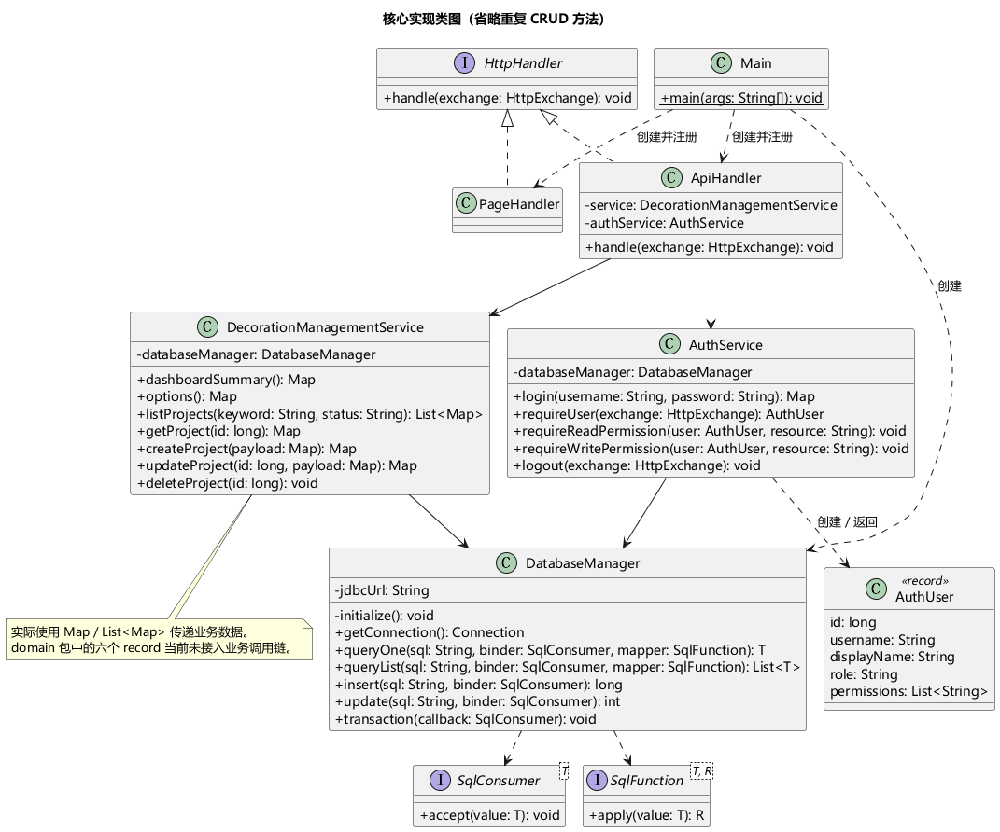

源码依据：`ApiHandler.java、AuthService.java、DecorationManagementService.java、DatabaseManager.java`。

## 2. 领域 record 类图

展示已有的六个 record 与基于编号的逻辑关系。它们尚未被业务服务使用；虚线不表示对象引用或组合所有权。

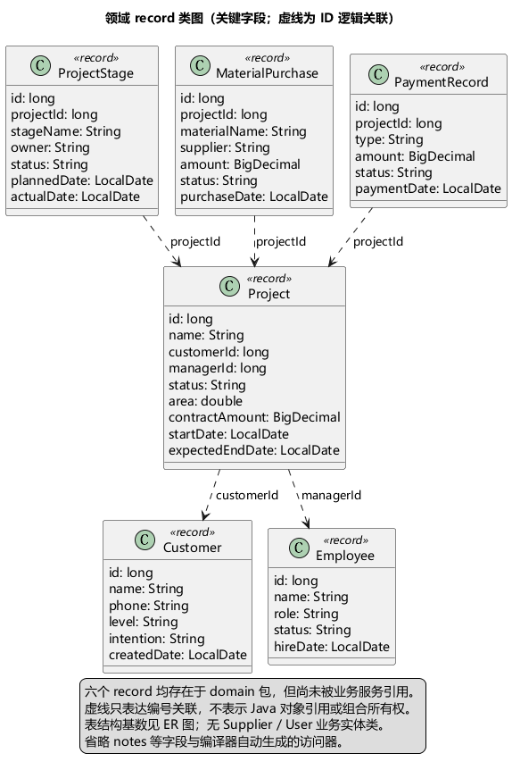

源码依据：`domain/*.java`。

## 3. 角色用例图

以系统用户为公共父角色，区分查看与维护权限；维护包含查看、新增、修改、删除。角色对应 ADMIN、MANAGER、FINANCE、DESIGNER。

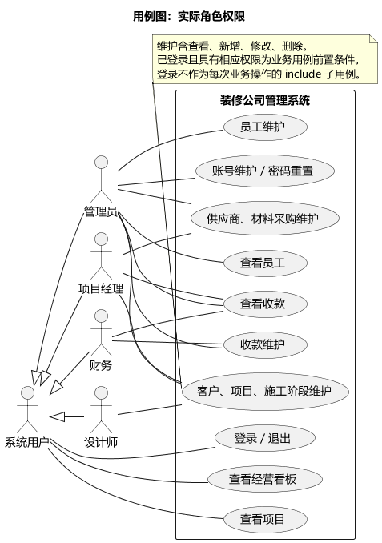

源码依据：`AuthService.READ_ROLES / WRITE_ROLES、ApiHandler.route*`。

## 4. 分层组件架构图

浏览器、JDK HttpServer、处理器、安全与业务服务、JDBC、H2 的真实调用关系。

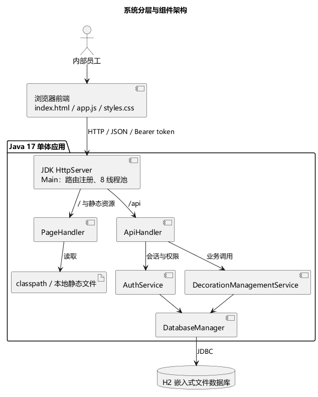

源码依据：`Main.java、PageHandler.java、ApiHandler.java`。

## 5. 包图

项目内部包依赖。domain 当前无入向业务依赖，不虚构 DAO、Repository 或 Spring 层。

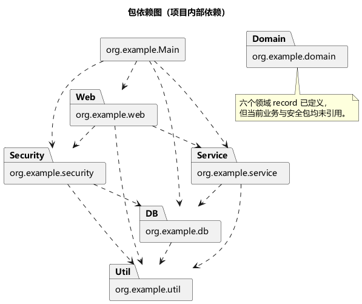

源码依据：`各 Java 文件的 import 与实际引用`。

## 6. 登录时序图

包含空参数、账号不存在或停用、密码错误与成功分支。成功时生成 12 小时会话，前端将 token 保存到 localStorage。

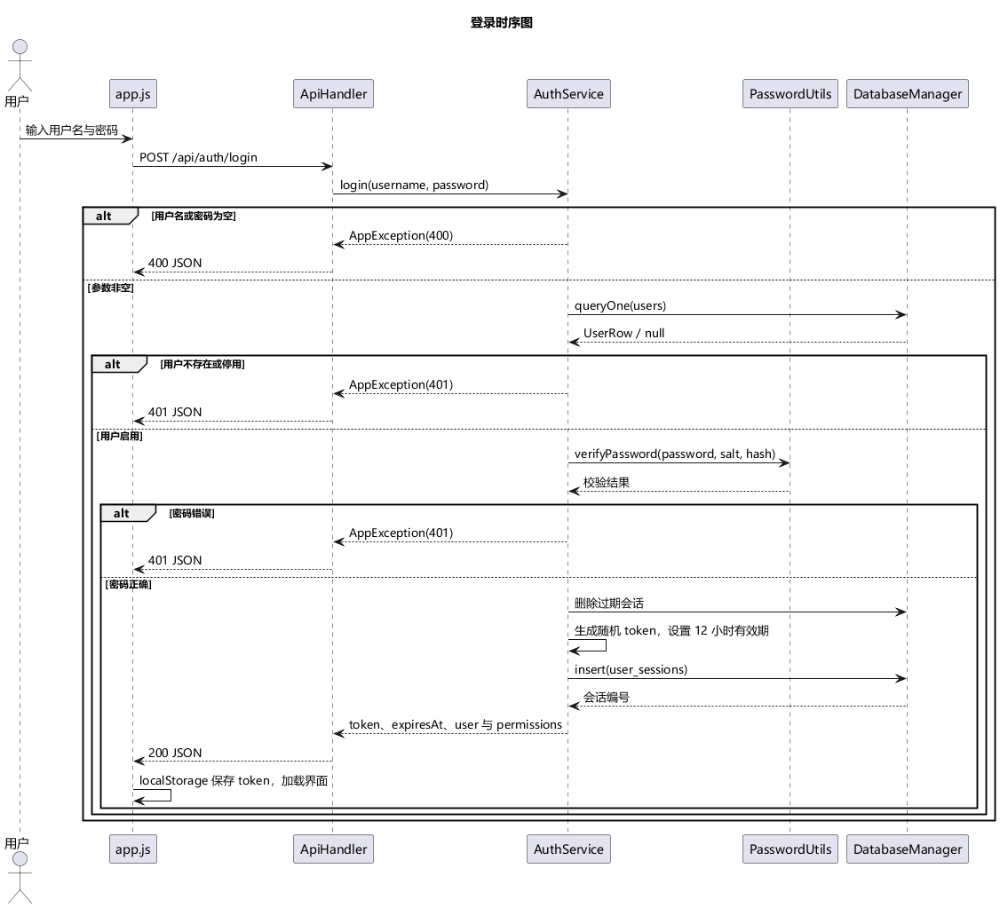

源码依据：`AuthService.login、ApiHandler.routeAuth、static/app.js`。

## 7. 新建项目时序图

展示鉴权、关联检查、参数绑定、插入和详情回查。错误出口以注释说明；创建操作未使用 DatabaseManager.transaction。

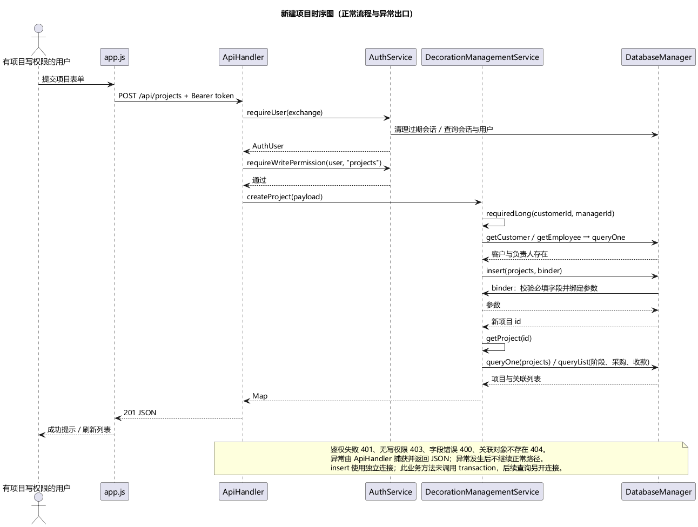

源码依据：`ApiHandler.routeProjects、DecorationManagementService.createProject/getProject`。

## 8. 通信图（协作图）

通过对象链接和编号消息表示新建项目的协作顺序，是独立通信图，不以时序图替代。

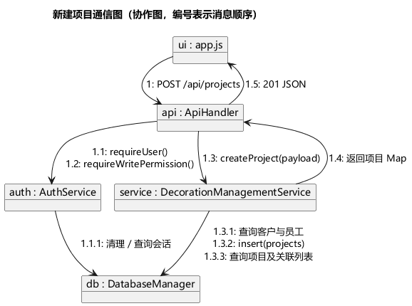

源码依据：`同新建项目时序图`。

## 9. 新建项目活动图

覆盖会话、权限、编号、关联存在性和字段校验分支。数据库异常路径为简化而省略。

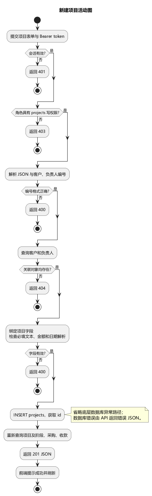

源码依据：`createProject、requiredLong、requiredText、requiredDecimal、parseDate`。

## 10. 项目状态图

状态名称取自实际选项；箭头为建议业务生命周期。代码并未实现状态机，也未校验转换顺序或枚举值；创建默认状态为施工中。

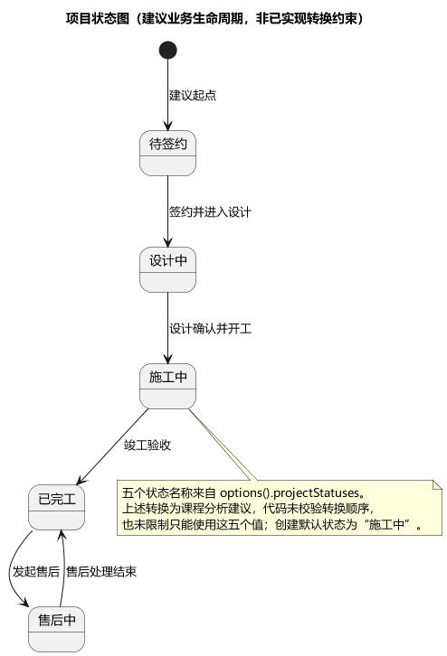

源码依据：`DecorationManagementService.options/createProject/updateProject`。

## 11. 部署图

默认浏览器—Java 单进程—H2 文件部署。端口默认 8080，可用 PORT 覆盖；H2 为嵌入式驱动，JDBC URL 含 AUTO_SERVER=TRUE。

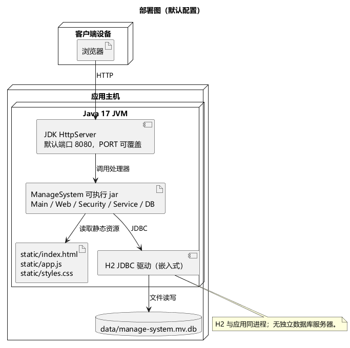

源码依据：`Main.main、DatabaseManager 构造器、PageHandler`。

## 12. 数据库 ER 图

实线为 DDL 外键，虚线为逻辑关联。employee_id、supplier_id 没有数据库外键；员工账号一对一由服务检查。

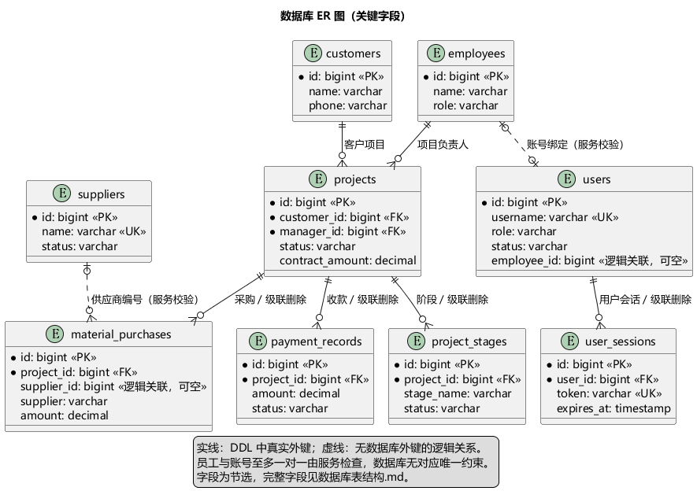

源码依据：`DatabaseManager.initialize、ensureEmployeeBindable、resolveSupplierName`。

## 课程提交说明

图表对应现有《课程设计报告》的 UML 清单。原始教师评分表未在本次核对中读取，若教师要求额外场景或固定版式，应再按评分表补充。

建议将第 4、5、11 图用于总体设计，第 1、2 图用于详细设计，第 3 图用于需求分析，第 6—10 图用于动态建模，第 12 图用于数据库设计。状态图须保留“建议生命周期”的说明，不能表述为系统已强制执行。

项目存在尚未接入业务层的领域 record、未约束的状态值与部分逻辑关联；这些是当前实现边界。此次只生成文档和图表，没有修改业务代码，也未运行功能测试。

## 本地重新渲染

准备 PlantUML jar 和 Java，在项目根目录执行：

```powershell
./docs/uml/render.ps1 -PlantUmlJar 'C:\tools\plantuml.jar' -Java 'C:\path\to\java.exe'
```

脚本生成同目录 PNG/SVG，检查渲染退出码、PNG 文件头和 SVG XML 根元素。结构类图使用 Smetana 布局，无需独立 Graphviz。默认中文字体为 Microsoft YaHei，跨平台渲染时需确保中文字体可用。
