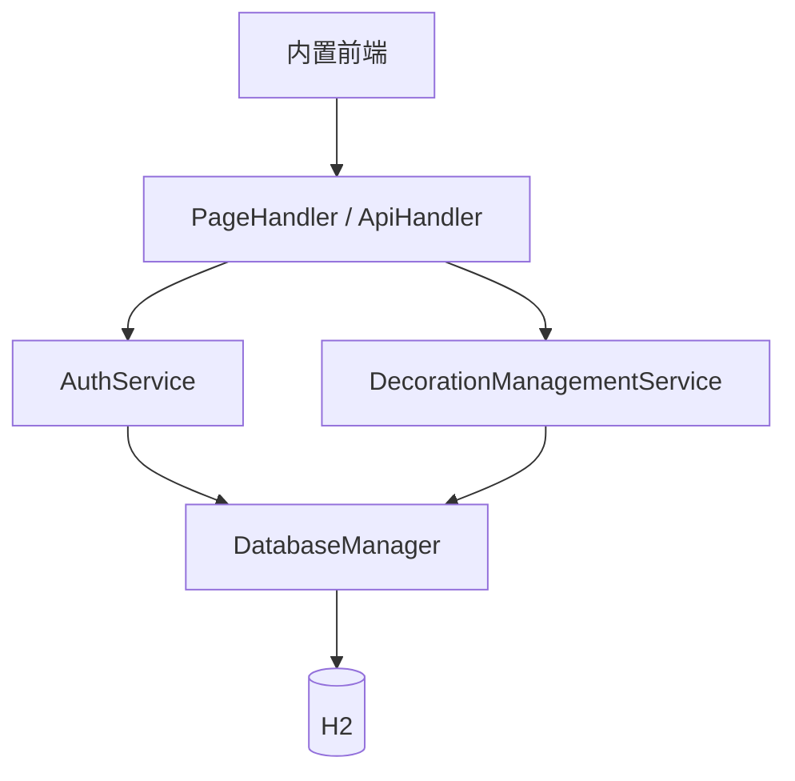

# 课程设计报告

本文件按照课程资料《软件开发案例分析课程设计报告》的章节要求，将当前装修公司管理系统映射为可提交的课程设计报告结构。课程模板要求覆盖问题定义和可行性分析、需求分析、总体设计、UML 图、详细设计、数据库分析与设计、实现与测试、参考文献和附录。

## 一、课程设计目的

本项目用于实践软件开发分析、需求建模、总体设计、详细设计、编码实现和测试验证。项目将装修企业中的客户、人员、项目、施工、供应链和收款业务抽象为可运行的管理系统，综合使用面向对象程序设计、数据库、Java Web 和软件工程知识。

## 二、问题定义与可行性分析

### 2.1 问题定义

装修企业的客户线索、员工账号、项目进度、材料采购和收款记录如果分散在表格或聊天记录中，容易出现数据重复、权限边界不清、进度难以追踪和统计口径不一致等问题。本项目建设一个面向内部员工的轻量级管理平台，统一维护上述业务数据，并根据角色控制可见范围和可执行操作。

### 2.2 建设目标

- 建立客户、员工、账号、项目和供应链主数据
- 支持项目施工阶段和收款过程管理
- 为管理员、项目经理、财务和设计师提供差异化权限
- 通过 H2 文件数据库实现低成本部署和数据持久化
- 提供可直接运行的 Java 服务和内置前端

### 2.3 可行性分析

| 方面 | 分析结论 |
| --- | --- |
| 技术可行性 | 使用 Java 17 JDK HttpServer、JDBC、H2 和原生前端，依赖少，适合课程设计环境 |
| 运行可行性 | 单个 Java 进程即可启动，默认使用本地文件数据库，不依赖外部应用服务器 |
| 经济可行性 | 使用开源运行时和嵌入式数据库，部署成本低 |
| 操作可行性 | 浏览器访问，按角色显示菜单和操作，符合内部管理场景 |
| 扩展可行性 | 业务服务、Web 路由、数据库和前端资源已分层，可继续扩展 Spring Boot、MySQL 或前后端分离架构 |

## 三、需求分析

### 3.1 用户角色

| 角色 | 核心操作 |
| --- | --- |
| 管理员 | 全部业务模块的查看、新增、修改、删除；账号创建、员工绑定和密码重置 |
| 项目经理 | 客户、项目、施工阶段、供应商和材料采购维护；员工和收款查看 |
| 财务 | 收款维护；经营看板和项目查看 |
| 设计师 | 客户、项目和施工阶段维护 |

### 3.2 功能需求

1. 用户可以登录、退出并查询当前用户信息。
2. 系统根据角色加载读权限、写权限和删除权限。
3. 用户可以在授权范围内维护客户、员工、账号、项目、施工阶段、供应商、材料采购和收款记录。
4. 系统提供经营看板和选项数据，供前端展示和表单选择。
5. 系统应保存数据，重启后仍可读取已写入的数据。
6. 删除项目时，应按数据库级联关系处理关联施工阶段、采购和收款记录。

### 3.3 非功能需求

- 易部署：不依赖 Spring Boot、Tomcat 或外部数据库
- 可维护：按 Web、安全、业务、数据、领域和工具职责分包
- 一致性：重要业务写入使用事务；数据库初始化和迁移可重复执行
- 安全性：密码使用盐值和哈希保存，接口使用 Bearer token，会话保存过期时间
- 易用性：前端按权限隐藏无权菜单和操作入口

## 四、总体设计

总体架构、分层职责、请求流程和项目结构见[系统架构](系统架构.md)。系统由浏览器、内置 Java HTTP 服务和 H2 文件数据库组成：

## 五、UML 图清单

课程模板要求的 UML 内容已集中放在[系统设计与 UML](系统设计与UML.md)：

| 课程要求 | 当前项目交付物 |
| --- | --- |
| 类的总体图/类图 | 核心实现类图与领域 record 类图；区分实际调用关系与尚未接入业务层的数据定义 |
| 包图 | `org.example` 下的 `web`、`security`、`service`、`db`、`domain`、`util` 包图 |
| 配置图/部署图 | 浏览器、Java 17 进程、classpath 静态资源和 H2 文件数据库部署图 |
| 用例图 | 管理员、项目经理、财务、设计师与业务模块用例图 |
| 时序图 | 登录会话创建、新建项目与详情回查时序 |
| 协作图 | 新建项目的对象通信图，以编号消息表示协作顺序 |
| 状态图 | 待签约、设计中、施工中、已完工、售后中的建议生命周期；代码未强制约束转换 |
| 活动图 | 新建项目的权限、关联与字段校验、插入和回查流程 |
| ER 图 | 用户、会话、员工、客户、项目、阶段、供应商、采购和收款关系 |

上述图册交付 12 组 `.puml`、PNG 和 SVG 文件，位于 `docs/uml`。图片可直接插入报告；状态图应保留“建议生命周期”说明。业务层当前使用 Map 传递数据，domain record 尚未接入；新建项目未调用显式多语句事务。项目详情会附带阶段、采购和收款列表，顶层模块权限不等于关联明细隔离。

## 六、详细设计

### 6.1 认证与权限模块

`AuthService` 负责登录、退出、当前用户、Bearer token、过期会话清理和权限校验。权限按资源划分为读、写和删除三类，角色权限映射集中在安全层。

### 6.2 业务模块

`DecorationManagementService` 按业务资源提供列表、详情、新增、修改和删除操作，并负责字段校验、关联对象检查、角色/状态标准化、金额和日期转换以及数据库结果映射。

### 6.3 Web 模块

`ApiHandler` 负责解析 HTTP 方法和路径，将 `/api/auth`、`/api/customers`、`/api/employees`、`/api/users`、`/api/projects`、`/api/stages`、`/api/suppliers`、`/api/materials` 和 `/api/payments` 路由到安全层和业务层。`PageHandler` 负责首页和静态资源。

### 6.4 数据库设计

数据库表、字段、类型、主键、外键、级联规则和逻辑关联见[数据库表结构](数据库表结构.md)。数据库初始化由 `DatabaseManager.initialize` 完成，数据迁移兼容历史员工角色、账号绑定和供应商关联。

## 七、实现与测试

### 7.1 实现内容

- Java 17 `HttpServer` 启动服务
- H2 2.2.224 文件数据库建表、初始化和迁移
- 原生前端完成登录、菜单权限、列表、表单和看板渲染
- 使用 Maven 打包可执行 jar，同时提供跨平台 `start.sh`

### 7.2 测试层次

按照课程模板的模块测试、子系统测试、系统测试和验收测试组织：

| 测试层次 | 当前项目建议验证内容 |
| --- | --- |
| 模块测试 | 密码哈希、JSON 解析、日期/金额校验、权限判断和数据库事务 |
| 子系统测试 | 登录会话、客户 CRUD、项目与阶段关联、采购与供应商关联、收款维护 |
| 系统测试 | 启动服务后从浏览器登录，按四种角色检查菜单、读权限和写权限 |
| 验收测试 | 创建客户、员工、项目、阶段、供应商、采购和收款，重启后确认数据仍存在 |

运行方式和验收步骤见[开发与运行](开发与运行.md)以及[接口文档](接口文档.md)。

## 八、参考文献与资料

课程资料目录中包含课程导言、课程设计报告模板、UML 复习材料和课程设计报告范例。本项目技术实现参考 Java 17、JDK HttpServer、JDBC、H2 和 Mermaid 文档；具体接口和表结构以仓库中的实现和文档为准。

## 九、附录

- 附录 A：默认账号见[开发与运行](开发与运行.md)
- 附录 B：完整数据库字段见[数据库表结构](数据库表结构.md)
- 附录 C：完整接口清单见[接口文档](接口文档.md)
- 附录 D：UML 图源代码见[系统设计与 UML](系统设计与UML.md)
